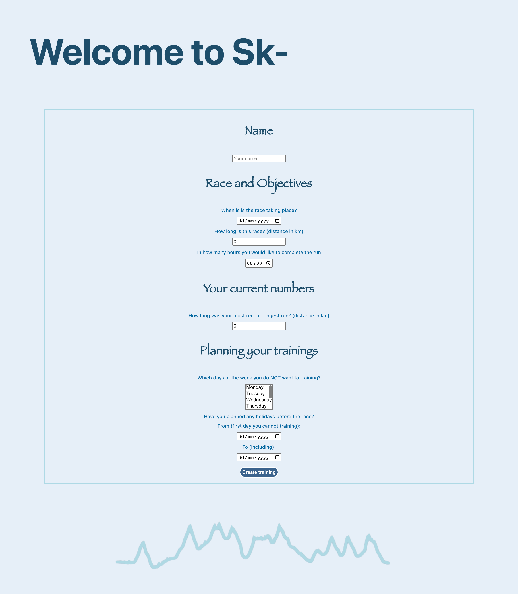
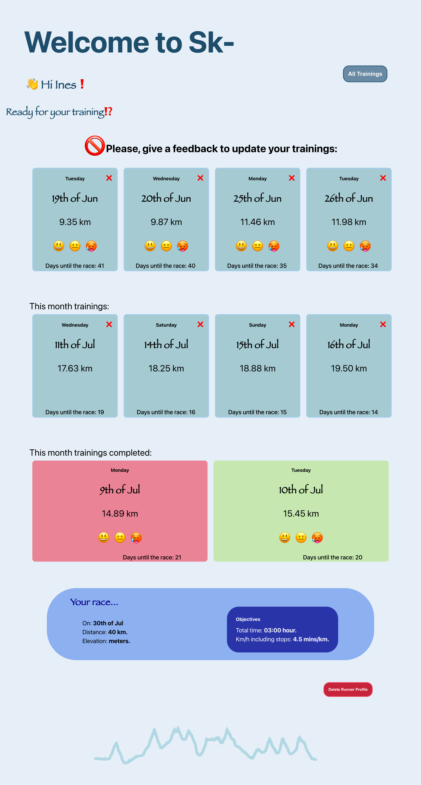
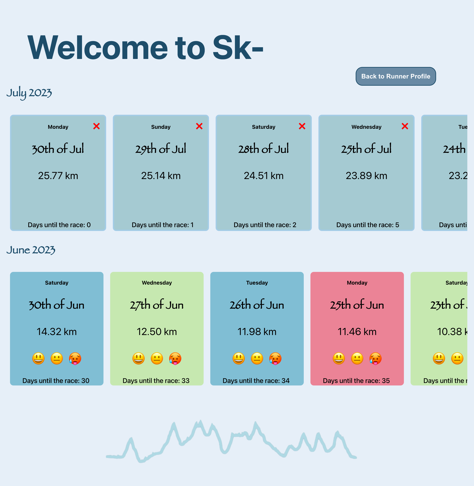

# Sk-

Sk- is a running app designed to assist users in determining the optimal duration of their training sessions for a specific race. The app collects user data through a form and analyses it to calculate training recommendations based o factors such as available training days, the users current running ability, and feedback from previous workouts. The app dynamically updates the data bases on user interactions. For example, if a training session is deleted, the remaining training sessions between the current day and the race day are equally adjusted to ensure the user stays on track to achieve their goal.

SK- accessibility and SEO to ensure a seamless experience across different devices. It has undergone rigorous testing and validation, resulting in 0 issues identified by Axe Dev Tools.
Additionally, the app has achieved high accessibility and SEO scores in Lighthouse. Sk- excels in both desktop and mobile environments, demonstrating a commitment to providing an inclusive and optimized experience to users. These high scores reflect the app's adherence to best practices for accessibility and SEO, ensuring that it can be easily discovered by search engines and accessed by users of all abilities.

    
    
    

## To run this app:
1. Clone the repository and open it in your preferred source code editor.
2. Open your terminal and navigate to the server folder:
    `cd server`
3. Install the necessary dependencies:
    `npm install`
4. Start the server using nodemon:
    `nodemon index.js`
5. Open another terminal tab or window.
6. Navigate to the client folder:
    `cd client`
7. Install the necessary dependencies for the client:
    `npm install`
8. Run the client application:
    `npm run start`

## Tech Stack
### FRONT-END
  - React

### BACK-END
  - Node.js
  - Express
  - Mongo-DB - Mongoose

